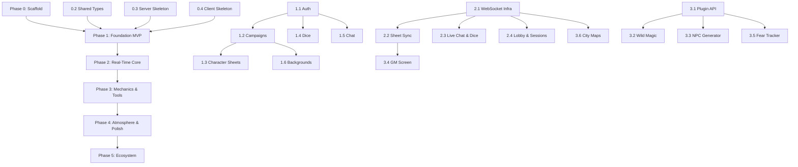

# 🏗️ Horizon — Implementation Plan

> **Date:** 2026-07-09
> **Stack:** React 19 + TypeScript + Vite · Node.js + Fastify · SQLite · Socket.IO
> **Related:** [Design Doc](./vtt-design-doc.md)

---

## Overview

This plan breaks Horizon into **6 phases** (0–5). Each phase lists concrete tasks, organized by layer — **shared** (types & rules), **server** (backend), and **client** (frontend). Tasks within a phase are ordered by dependency: build the thing that other things depend on first.

---

## Phase 0 — Project Scaffold

**Goal:** A working monorepo with an empty Express… er, Fastify server, a blank Vite + React app, shared types, and dev tooling. Nothing user-facing yet — just the skeleton.

### 0.1 Monorepo & Tooling

| #     | Task                           | Details                                                                   |
| ----- | ------------------------------ | ------------------------------------------------------------------------- |
| 0.1.1 | Initialize root `package.json` | npm workspaces: `client`, `server`, `shared`                              |
| 0.1.2 | Add root scripts               | `dev` (concurrently runs client + server), `build`, `lint`, `test`        |
| 0.1.3 | ESLint + Prettier config       | Shared config in root; extends to all packages                            |
| 0.1.4 | TypeScript config              | `tsconfig.base.json` in root; each package extends it                     |
| 0.1.5 | Git repo init + `.gitignore`   | `node_modules/`, `data/`, `dist/`, `.env`                                 |
| 0.1.6 | `.vscode/launch.json`          | 3 debug configurations: Server (attach), Client (Chrome), Both (compound) |
| 0.1.7 | `.vscode/tasks.json`           | Build, dev, and migrate tasks for server, client, and full stack          |

#### `.vscode/launch.json`

```json
{
  "version": "0.2.0",
  "configurations": [
    {
      "name": "🚀 Launch Server",
      "type": "node",
      "request": "launch",
      "runtimeExecutable": "npx",
      "runtimeArgs": ["tsx", "--inspect", "server/src/index.ts"],
      "cwd": "${workspaceFolder}",
      "env": { "NODE_ENV": "development" },
      "console": "integratedTerminal",
      "skipFiles": ["<node_internals>/**"]
    },
    {
      "name": "🌐 Launch Client",
      "type": "chrome",
      "request": "launch",
      "url": "http://localhost:5173",
      "webRoot": "${workspaceFolder}/client/src",
      "sourceMapPathOverrides": {
        "webpack:///./src/*": "${webRoot}/*"
      }
    },
    {
      "name": "🎯 Launch Both",
      "type": "node",
      "request": "launch",
      "runtimeExecutable": "npx",
      "runtimeArgs": [
        "concurrently",
        "-n",
        "server,client",
        "-c",
        "blue,green",
        "npm run dev -w server",
        "npm run dev -w client"
      ],
      "cwd": "${workspaceFolder}",
      "console": "integratedTerminal"
    }
  ]
}
```

#### `.vscode/tasks.json`

```json
{
  "version": "2.0.0",
  "tasks": [
    {
      "label": "dev:server",
      "type": "shell",
      "command": "npm run dev -w server",
      "isBackground": true,
      "problemMatcher": [],
      "presentation": { "group": "server", "panel": "dedicated" }
    },
    {
      "label": "dev:client",
      "type": "shell",
      "command": "npm run dev -w client",
      "isBackground": true,
      "problemMatcher": [],
      "presentation": { "group": "client", "panel": "dedicated" }
    },
    {
      "label": "dev:all",
      "dependsOn": ["dev:server", "dev:client"],
      "problemMatcher": []
    },
    {
      "label": "build:all",
      "type": "shell",
      "command": "npm run build",
      "group": { "kind": "build", "isDefault": true },
      "problemMatcher": []
    },
    {
      "label": "db:migrate",
      "type": "shell",
      "command": "npm run migrate -w server",
      "problemMatcher": []
    },
    {
      "label": "db:seed",
      "type": "shell",
      "command": "npm run seed -w server",
      "problemMatcher": []
    }
  ]
}
```

> **How to use:** `Ctrl+Shift+B` → `build:all` to build everything. `Ctrl+Shift+D` → pick **"🎯 Launch Both"** → F5 to start the full stack with breakpoint support. Server breakpoints hit in `server/src/`; client breakpoints hit in Chrome (install the **Debugger for Chrome** extension). Run `Ctrl+Shift+P` → `Tasks: Run Task` → `db:migrate` once after first clone to set up the database.

### 0.2 Shared Package

| #     | Task                           | Details                                                                                                         |
| ----- | ------------------------------ | --------------------------------------------------------------------------------------------------------------- |
| 0.2.1 | `shared/types.ts`              | Core types: `User`, `Campaign`, `Character`, `NPC`, `Session`, `DiceRoll`, `ChatMessage`, `SheetData`           |
| 0.2.2 | `shared/rules/dice.ts`         | Dice pool parser (`"3d6+2a"` → structured pool), roll resolver (pure function — server uses it, client can too) |
| 0.2.3 | `shared/rules/stats.ts`        | Stat definitions, adversity token rules, Kids on Bikes success/fail logic                                       |
| 0.2.4 | `shared/mechanic-interface.ts` | `GameMechanic`, `MechanicProps`, `MechanicEvent`, `MechanicResult` interfaces (see design doc §4.8)             |

### 0.3 Server Skeleton

| #     | Task                                | Details                                                                                                                                                         |
| ----- | ----------------------------------- | --------------------------------------------------------------------------------------------------------------------------------------------------------------- |
| 0.3.1 | Initialize `server/` with Fastify   | `npm init` + install `fastify`, `@fastify/cors`, `@fastify/websocket` (or Socket.IO)                                                                            |
| 0.3.2 | `server/src/index.ts`               | Boots Fastify on port 3001; health-check endpoint `GET /api/health`                                                                                             |
| 0.3.3 | `server/src/config.ts`              | Env vars: `PORT`, `DATABASE_PATH`, `JWT_SECRET`, `UPLOAD_DIR`                                                                                                   |
| 0.3.4 | `server/src/models/db.ts`           | Initialize `better-sqlite3`; create `data/` dir if missing                                                                                                      |
| 0.3.5 | `server/src/middleware/`            | Auth middleware (JWT verify, attach `req.user`), error handler, request logger                                                                                  |
| 0.3.6 | `server/migrations/001_initial.sql` | Full schema from design doc §4.2 (users, campaigns, campaign_players, characters, npcs, sessions, session_attendance, dice_logs, chat_messages, refresh_tokens) |
| 0.3.7 | Migration runner                    | Simple script: reads `.sql` files from `migrations/`, tracks applied migrations in a `_migrations` table                                                        |

### 0.4 Client Skeleton

| #     | Task                                                   | Details                                                                                                                                              |
| ----- | ------------------------------------------------------ | ---------------------------------------------------------------------------------------------------------------------------------------------------- |
| 0.4.1 | Initialize `client/` with Vite + React 19 + TypeScript | `npm create vite@latest`                                                                                                                             |
| 0.4.2 | `client/src/main.tsx` + `App.tsx`                      | React root with React Router (BrowserRouter)                                                                                                         |
| 0.4.3 | `client/src/api/client.ts`                             | Thin fetch wrapper: `api.get()`, `api.post()`, `api.put()`, `api.delete()` with JWT header injection and 401 interceptor (calls `/api/auth/refresh`) |
| 0.4.4 | `client/src/stores/`                                   | Install Zustand; create empty `authStore`, `campaignStore` shells                                                                                    |
| 0.4.5 | Dark theme CSS variables                               | `client/src/styles/theme.css` — CSS custom properties for the dark theme (colors, spacing, typography)                                               |
| 0.4.6 | Dev proxy config                                       | Vite proxy: `/api` → `http://localhost:3001`, `/ws` → `http://localhost:3001`                                                                        |

### Phase 0 Milestone

```bash
npm run dev     # → Server on :3001, Client on :5173
curl localhost:3001/api/health  # → { "status": "ok" }
```

✅ Monorepo builds. Server boots. Client renders a blank dark page. Shared types compile. F5 launches the full stack with breakpoints working in both server and client.

---

## Phase 1 — Foundation (MVP)

**Goal:** A playable VTT for one person. Auth works, you can create a campaign, make a character sheet, roll dice, see results in chat, and change the background. No real-time sync yet — pages refresh to see changes.

### 1.1 Auth (Server + Client)

| #     | Task                         | Depends On   | Details                                                                              |
| ----- | ---------------------------- | ------------ | ------------------------------------------------------------------------------------ |
| 1.1.1 | `POST /api/auth/register`    | 0.3.5, 0.3.6 | Hash password (bcrypt), insert user, return JWT pair                                 |
| 1.1.2 | `POST /api/auth/login`       | 1.1.1        | Verify password, return `{ access_token, refresh_token, user }`                      |
| 1.1.3 | `POST /api/auth/refresh`     | 1.1.2        | Validate refresh token (hashed in DB), rotate, return new pair                       |
| 1.1.4 | `GET /api/auth/me`           | 1.1.1        | Return current user from JWT                                                         |
| 1.1.5 | `RegisterPage.tsx`           | 1.1.1        | Form: email, password, display name → calls register → redirects to login            |
| 1.1.6 | `LoginPage.tsx`              | 1.1.2        | Form: email, password → calls login → stores tokens → redirects to `/campaigns`      |
| 1.1.7 | `AuthGuard.tsx`              | 1.1.2        | Wraps protected routes; checks for valid token; redirects to login if missing        |
| 1.1.8 | `useAuth` hook + `authStore` | 1.1.2        | Stores user + tokens; provides `login()`, `register()`, `logout()`, `refreshToken()` |

### 1.2 Campaigns (Server + Client)

| #     | Task                              | Depends On | Details                                                                                                                            |
| ----- | --------------------------------- | ---------- | ---------------------------------------------------------------------------------------------------------------------------------- |
| 1.2.1 | `GET /api/campaigns`              | 0.3.6      | List campaigns the user belongs to (GM or player)                                                                                  |
| 1.2.2 | `POST /api/campaigns`             | 1.2.1      | Create campaign; creator is auto-assigned as GM                                                                                    |
| 1.2.3 | `GET /api/campaigns/:id`          | 1.2.1      | Campaign detail + list of players + list of characters                                                                             |
| 1.2.4 | `POST /api/campaigns/:id/join`    | 1.2.1      | Join by invite code (generate a short alphanumeric code on campaign create)                                                        |
| 1.2.5 | `DELETE /api/campaigns/:id/leave` | 1.2.4      | Remove self from campaign (GM cannot leave — must delete campaign)                                                                 |
| 1.2.6 | `CampaignListPage.tsx`            | 1.2.1      | Grid of campaign cards; "Create New" button; click to enter a campaign                                                             |
| 1.2.7 | `CreateCampaignModal.tsx`         | 1.2.2      | Name + description form; shows invite code after creation                                                                          |
| 1.2.8 | `CampaignLayout.tsx`              | 1.2.3      | Shell for inside a campaign: sidebar nav (Sheets, Dice, Chat, Backgrounds), active background fills the viewport behind everything |
| 1.2.9 | `campaignStore`                   | 1.2.3      | Zustand store: `currentCampaign`, `players`, `characters`; actions to fetch/update                                                 |

### 1.3 Character Sheets (Server + Client)

| #     | Task                                     | Depends On | Details                                                                                                                                              |
| ----- | ---------------------------------------- | ---------- | ---------------------------------------------------------------------------------------------------------------------------------------------------- |
| 1.3.1 | `GET /api/campaigns/:id/characters`      | 0.3.6      | List characters in campaign                                                                                                                          |
| 1.3.2 | `POST /api/campaigns/:id/characters`     | 1.3.1      | Create new character with initial `sheet_data`                                                                                                       |
| 1.3.3 | `PUT /api/campaigns/:id/characters/:cid` | 1.3.2      | Full sheet update (Phase 1: save-on-blur or save-button; Phase 2 makes this real-time)                                                               |
| 1.3.4 | `SheetView.tsx`                          | 1.3.1      | Read-only view of a character sheet: stats (6 stat bars), adversity tokens (counter), inventory (list), traits (tags), conditions (badges), portrait |
| 1.3.5 | `SheetEdit.tsx`                          | 1.3.3      | Editable version: click stat to +/-, drag adversity tokens, add/edit/remove inventory items, add/remove traits and conditions                        |
| 1.3.6 | `PortraitUpload.tsx`                     | 1.3.5      | File input → `POST /api/upload` → stores in `data/uploads/` → sets `portrait_url`                                                                    |

### 1.4 Dice Engine (Server + Client)

| #     | Task                              | Depends On   | Details                                                                                                                            |
| ----- | --------------------------------- | ------------ | ---------------------------------------------------------------------------------------------------------------------------------- |
| 1.4.1 | `server/src/services/dice.ts`     | 0.2.2        | `roll(pool: DicePool): DiceResult` — server-side RNG, logs to `dice_logs` table                                                    |
| 1.4.2 | `POST /api/dice/roll`             | 1.4.1        | REST endpoint: `{ pool: "3d6", reason: "Cognition check", character_id }` → result. Phase 1 uses REST; Phase 2 moves to WebSocket. |
| 1.4.3 | `GET /api/campaigns/:id/dice-log` | 1.4.1        | Paginated dice history for a campaign/session                                                                                      |
| 1.4.4 | `DiceTray.tsx`                    | 1.4.2        | Input field for custom rolls (`"2d8+1d6"`) + Quick Roll buttons (d4, d6, d8, d10, d12, d20)                                        |
| 1.4.5 | `DiceAnimation.tsx`               | 1.4.2        | CSS keyframe spin (~1 second); shows individual die results, then total                                                            |
| 1.4.6 | `StatRollButton.tsx`              | 1.4.2, 1.3.4 | Small die icon next to each stat on the sheet; click → auto-rolls `{stat_value}d6` for that stat                                   |
| 1.4.7 | `DiceLogPanel.tsx`                | 1.4.3        | Scrollable history: who rolled what, total, reason, timestamp                                                                      |

### 1.5 Chat (Server + Client)

| #     | Task                           | Depends On   | Details                                                                                                                        |
| ----- | ------------------------------ | ------------ | ------------------------------------------------------------------------------------------------------------------------------ |
| 1.5.1 | `POST /api/campaigns/:id/chat` | 0.3.6        | Post a chat message (Phase 1: REST; Phase 2: WebSocket). Stores in `chat_messages`.                                            |
| 1.5.2 | `GET /api/campaigns/:id/chat`  | 1.5.1        | Fetch recent messages (polled every 3 seconds in Phase 1 — replaced by WebSocket in Phase 2)                                   |
| 1.5.3 | `ChatPanel.tsx`                | 1.5.2        | Message list + input bar. Messages render by type: `text` (plain message), `dice` (DiceCard embed), `system` (italicized gray) |
| 1.5.4 | `DiceCard.tsx`                 | 1.4.2, 1.5.3 | Compact embed: roller name, pool, individual results, total, reason. Gets posted to chat automatically on every roll.          |

### 1.6 Dynamic Backgrounds (Server + Client)

| #     | Task                                 | Depends On   | Details                                                                                                                  |
| ----- | ------------------------------------ | ------------ | ------------------------------------------------------------------------------------------------------------------------ |
| 1.6.1 | `POST /api/campaigns/:id/background` | 0.3.6        | GM sets active background URL (stored on `campaigns.active_background_url`)                                              |
| 1.6.2 | `GET /api/backgrounds/library`       | —            | List bundled preset backgrounds (static JSON file or DB table)                                                           |
| 1.6.3 | `POST /api/upload`                   | 0.3.5        | File upload endpoint → saves to `data/uploads/backgrounds/` → returns URL                                                |
| 1.6.4 | `BackgroundLayer.tsx`                | 1.6.1        | Full-viewport `<div>` behind all UI; `background-image: url(...)` with `cover` sizing. Rendered inside `CampaignLayout`. |
| 1.6.5 | `BackgroundPicker.tsx`               | 1.6.2, 1.6.3 | GM-only panel: grid of preset thumbnails + "Upload Custom" button. Click to apply instantly.                             |

### Phase 1 Milestone

1. Register an account, log in
2. Create a campaign, see the invite code
3. Create a character with stats, traits, inventory, portrait
4. Click a stat → die spins → result appears in chat as a styled embed
5. Type a chat message → it appears (after refresh or poll)
6. GM picks a background → it fills the screen
7. Dice log shows all rolls in the session

✅ One person can play. The core loop works: sheet → roll → chat. No real-time yet.

---

## Phase 2 — Real-Time Core

**Goal:** Multiplayer. The GM can open a player's sheet, edit a stat, and the player sees it change instantly. Chat is live. Dice results broadcast to everyone. Players see who's online.

### 2.1 WebSocket Infrastructure

| #     | Task                               | Depends On | Details                                                                                                                                  |
| ----- | ---------------------------------- | ---------- | ---------------------------------------------------------------------------------------------------------------------------------------- |
| 2.1.1 | `server/src/ws/index.ts`           | 0.3.2      | Socket.IO server attached to Fastify HTTP server. Auth via `auth` event (validates JWT). Joins user to campaign room on `campaign:join`. |
| 2.1.2 | `server/src/ws/auth.ts`            | 2.1.1      | WS middleware: verify JWT on connect; attach `socket.data.user`; reject invalid tokens                                                   |
| 2.1.3 | `server/src/ws/rooms.ts`           | 2.1.1      | Room management: `campaign:{id}` room per campaign. On join, broadcast presence. On disconnect, broadcast departure.                     |
| 2.1.4 | `client/src/hooks/useWebSocket.ts` | 2.1.1      | React hook: connects to Socket.IO, handles auth, auto-reconnect, exposes `socket` instance + `connected` state                           |
| 2.1.5 | `client/src/stores/wsStore.ts`     | 2.1.4      | Zustand store: tracks `onlineUsers` in current campaign, `wsConnected` flag                                                              |

### 2.2 Real-Time Sheet Sync

| #     | Task                                   | Depends On   | Details                                                                                                                                                                        |
| ----- | -------------------------------------- | ------------ | ------------------------------------------------------------------------------------------------------------------------------------------------------------------------------ |
| 2.2.1 | `server/src/ws/sheets.ts`              | 2.1.1        | Handlers for `sheet:update`, `sheet:addItem`, `sheet:removeItem`, `sheet:undo`. Validates permissions (GM or owning player). Writes to DB. Broadcasts to all in campaign room. |
| 2.2.2 | `server/src/services/sheet-history.ts` | 2.2.1        | Maintains per-character edit log (last 50 ops) in memory or a DB table. Supports `undo`.                                                                                       |
| 2.2.3 | `useSheetSync` hook                    | 2.1.4, 2.2.1 | Subscribes to `sheet:updated`, `sheet:itemAdded`, `sheet:itemRemoved` events; updates local Zustand sheet store. Sends `sheet:update` on local edits.                          |
| 2.2.4 | Presence indicators                    | 2.2.3        | Track which user is viewing/editing which sheet via `sheet:viewing` and `sheet:editing` events. Show "GM is viewing" badge + purple left-border on actively edited fields.     |
| 2.2.5 | Hidden edit toggle                     | 2.2.1        | GM-only: edits with `hidden: true` flag are stored but not broadcast. A "Reveal changes" button broadcasts them all at once.                                                   |

### 2.3 Live Chat & Dice

| #     | Task                      | Depends On | Details                                                                                                             |
| ----- | ------------------------- | ---------- | ------------------------------------------------------------------------------------------------------------------- |
| 2.3.1 | `server/src/ws/chat.ts`   | 2.1.1      | Replace REST chat with WS: `chat:message` event → validate → store in DB → broadcast to room                        |
| 2.3.2 | `server/src/ws/dice.ts`   | 2.1.1      | Replace REST dice with WS: `dice:roll` event → server rolls → stores in DB → broadcasts `dice:result` to room       |
| 2.3.3 | Update `ChatPanel` for WS | 2.3.1      | Remove polling; use `useChatSync` hook that listens for `chat:message` events                                       |
| 2.3.4 | Update `DiceTray` for WS  | 2.3.2      | Emit `dice:roll` instead of POST; listen for `dice:result` to trigger animation                                     |
| 2.3.5 | Hidden rolls              | 2.3.2      | GM-only: `dice:roll` with `hidden: true` → result only sent to GM; players see "GM rolled in secret" system message |

### 2.4 Campaign Lobby & Sessions

| #     | Task                                   | Depends On | Details                                                                                                               |
| ----- | -------------------------------------- | ---------- | --------------------------------------------------------------------------------------------------------------------- |
| 2.4.1 | `PresenceBar.tsx`                      | 2.1.5      | Shows online player avatars at the top of the campaign screen; grays out offline players                              |
| 2.4.2 | `POST /api/campaigns/:id/sessions`     | 0.3.6      | Start a new session (GM only). Stores date + creates session record.                                                  |
| 2.4.3 | `PUT /api/campaigns/:id/sessions/:sid` | 2.4.2      | End session (GM only): sets end time, marks attendance                                                                |
| 2.4.4 | `SessionPanel.tsx`                     | 2.4.2      | GM tool: "Start Session" / "End Session" button; shows session duration; attendance auto-tracked from presence events |

### Phase 2 Milestone

1. Open two browser windows — log in as GM in one, player in another
2. GM opens player's sheet, edits a stat → player sees it change instantly with purple highlight
3. Player rolls dice → both see the animation and result in chat simultaneously
4. Chat messages appear in real-time; no polling
5. GM starts a session → attendance is logged
6. Player disconnects → their avatar grays out in the presence bar

✅ Two people can play together in real time. The core of the VTT works.

---

## Phase 3 — Mechanics & Tools

**Goal:** The custom mechanics engine comes alive. The GM has a dashboard of tools. The platform is extensible.

### 3.1 Mechanic Plugin API

| #     | Task                               | Depends On | Details                                                                                                   |
| ----- | ---------------------------------- | ---------- | --------------------------------------------------------------------------------------------------------- |
| 3.1.1 | `server/src/mechanics/registry.ts` | 0.2.4      | Plugin registry: loads mechanic handlers, routes `mechanic:invoke` to the right handler                   |
| 3.1.2 | `server/src/mechanics/base.ts`     | 3.1.1      | Base class / factory for mechanic handlers: validates input, calls mechanic logic, broadcasts result      |
| 3.1.3 | `client/src/mechanics/registry.ts` | 0.2.4      | Client-side registry: maps `mechanic_id` → React component                                                |
| 3.1.4 | `MechanicPanel.tsx`                | 3.1.3      | Generic panel: loads the active mechanic's component, passes `MechanicProps`, handles `onResult` callback |
| 3.1.5 | `PUT /api/campaigns/:id/mechanics` | 3.1.1      | Enable/disable mechanics per campaign. Stored as JSON array on `campaigns` table.                         |
| 3.1.6 | `GET /api/mechanics`               | 3.1.1      | List all registered mechanics with name, description, category                                            |

### 3.2 Wild Magic Generator (Port)

| #     | Task                                 | Depends On   | Details                                                                                                                                 |
| ----- | ------------------------------------ | ------------ | --------------------------------------------------------------------------------------------------------------------------------------- |
| 3.2.1 | Extract Wild Magic logic             | —            | From existing project: isolate the spell table, surge logic, and UI into standalone module                                              |
| 3.2.2 | `server/src/mechanics/wild-magic.ts` | 3.1.1, 3.2.1 | Server handler: resolves wild magic surge from spell table, tracks spells discovered per character in `sheet_data.mechanics.wild_magic` |
| 3.2.3 | `client/src/mechanics/wild-magic/`   | 3.1.3, 3.2.1 | React component: "Surge!" button, animated spell reveal card, spell discovery log per character                                         |
| 3.2.4 | Integration test                     | 3.2.2, 3.2.3 | GM enables Wild Magic for campaign → player clicks Surge → result posts to chat + tracks on sheet                                       |

### 3.3 NPC Generator

| #     | Task                                    | Depends On | Details                                                                                                                                           |
| ----- | --------------------------------------- | ---------- | ------------------------------------------------------------------------------------------------------------------------------------------------- |
| 3.3.1 | `server/src/services/npc-generator.ts`  | 0.3.6      | Generation logic: archetype templates (JSON file), stat rolling by threat level, trait/item selection from pools, plot hook selection             |
| 3.3.2 | `POST /api/campaigns/:id/npcs/generate` | 3.3.1      | REST endpoint: `{ template_id, threat_level }` → generated NPC (not saved yet)                                                                    |
| 3.3.3 | `POST /api/campaigns/:id/npcs`          | 3.3.2      | Save generated or manual NPC to campaign                                                                                                          |
| 3.3.4 | `GET /api/npc-templates`                | 3.3.1      | List available archetype templates with descriptions                                                                                              |
| 3.3.5 | `NPCGeneratorPanel.tsx`                 | 3.3.2      | GM tool: template picker (card grid), threat level slider (Pushover → Deadly), "Generate" button, editable result card, "Save to Campaign" button |
| 3.3.6 | `NameGenerator.tsx`                     | —          | Theme picker (80s, modern, gothic) + "Generate Names" button → shows 10 names; click one to use it for current NPC                                |

### 3.4 GM Screen

| #     | Task                | Depends On   | Details                                                                                                                      |
| ----- | ------------------- | ------------ | ---------------------------------------------------------------------------------------------------------------------------- |
| 3.4.1 | `GMSheetDock.tsx`   | 2.2.3        | Collapsible sidebar showing all character sheets as thumbnails; click to open in edit mode; shows stat summaries at a glance |
| 3.4.2 | `QuickToolsBar.tsx` | 3.3.5, 3.2.3 | Floating toolbar: Wild Magic button, NPC Gen button, Name Gen button, Fear Tracker button (future)                           |
| 3.4.3 | `GMNotesPanel.tsx`  | 0.3.6        | Private scratchpad per campaign; auto-saves; only visible to GM                                                              |

### 3.5 Fear/Sanity Tracker (Second Mechanic)

| #     | Task                                   | Depends On   | Details                                                                                 |
| ----- | -------------------------------------- | ------------ | --------------------------------------------------------------------------------------- |
| 3.5.1 | `shared/rules/fear.ts`                 | 0.2.4        | Fear rules: sanity thresholds, breakdown conditions, recovery                           |
| 3.5.2 | `server/src/mechanics/fear-tracker.ts` | 3.1.1, 3.5.1 | Server handler: applies fear damage, checks thresholds, posts narrative effects to chat |
| 3.5.3 | `client/src/mechanics/fear-tracker/`   | 3.1.3, 3.5.1 | Fear tracker panel: sanity bar per character, "Apply Fear" button, breakdown table      |

### 3.6 City Maps

| #      | Task                                          | Depends On   | Details                                                                                                |
| ------ | --------------------------------------------- | ------------ | ------------------------------------------------------------------------------------------------------ |
| 3.6.1  | Install Leaflet + react-leaflet               | —            | Free, zero API key; OpenStreetMap tile layer; lightweight (~40 KB gzipped)                             |
| 3.6.2  | `server/src/services/map-pins.ts`             | 0.3.6        | CRUD for `map_pins` table (campaign_id, lat, lng, label, color, category, character_id, created_by)    |
| 3.6.3  | `server/src/ws/map.ts`                        | 2.1.1, 3.6.2 | WS handlers: `map:addPin`, `map:movePin`, `map:removePin`, `map:setView`. Broadcasts to campaign room. |
| 3.6.4  | `GET/POST/DELETE /api/campaigns/:id/map/pins` | 3.6.2        | REST endpoints for initial pin load and pin management                                                 |
| 3.6.5  | `PUT /api/campaigns/:id/map/view`             | 3.6.2        | Persist the GM's last map center + zoom so it restores on reconnect                                    |
| 3.6.6  | `MapView.tsx`                                 | 3.6.1        | Leaflet map component: real city tiles, zoom/pan, click-to-add-pin, address search (Nominatim)         |
| 3.6.7  | `PinMarker.tsx`                               | 3.6.6        | Custom Leaflet marker: colored circle + label tooltip; character pins show portrait thumbnail          |
| 3.6.8  | `MapPanel.tsx`                                | 3.6.6        | Collapsible panel in campaign layout; GM sees full pin controls, players see pins + can move own       |
| 3.6.9  | `useMapSync` hook                             | 2.1.4, 3.6.3 | Subscribes to map WS events; updates local Zustand map store                                           |
| 3.6.10 | Hidden pins (GM-only)                         | 3.6.3        | `category: "gm-hidden"` pins are filtered out before broadcasting to non-GM clients                    |

### Phase 3 Milestone

1. Enable Wild Magic in a campaign → player uses it → spell surge appears in chat
2. GM generates a Deadly Bully NPC in 2 clicks → tweaks stats → saves to campaign
3. GM opens the sheet dock → sees all players' stat summaries → clicks one to edit
4. Fear tracker is enabled as a second mechanic → proves the plugin API works for multiple systems
5. GM opens the city map → drops pins for "The Diner", "Police Station", "Jamie's House" → all players see them appear in real time
6. Player moves their character pin to the library → GM sees the pin move instantly

✅ The GM has real tools. The platform is extensible with custom mechanics. The city has a map.

---

## Phase 4 — Atmosphere & Polish

**Goal:** The app feels immersive and finished. Music, transitions, mobile support, and a "spotlight mode" for dramatic moments.

### 4.1 Music & Ambience

| #     | Task                                | Depends On | Details                                                                                                                                                     |
| ----- | ----------------------------------- | ---------- | ----------------------------------------------------------------------------------------------------------------------------------------------------------- |
| 4.1.1 | `server/src/services/audio-sync.ts` | 2.1.1      | GM queues track; server broadcasts `audio:play` with track URL + timestamp; all clients sync playback                                                       |
| 4.1.2 | `AudioPlayer.tsx`                   | 4.1.1      | Hidden `<audio>` element; listens for `audio:play`, `audio:pause`, `audio:seek` WS events                                                                   |
| 4.1.3 | `AudioPanel.tsx`                    | 4.1.1      | GM-only: playlist manager (add/remove/reorder tracks), play/pause/skip, volume. Pre-built playlists: "Spooky Forest", "Chase Scene", "Emotional Revelation" |
| 4.1.4 | `POST /api/upload/audio`            | 4.1.3      | Upload audio files (MP3, OGG) to `data/uploads/audio/`                                                                                                      |

### 4.2 Narrative Spotlight Mode

| #     | Task                           | Depends On | Details                                                                                                                                   |
| ----- | ------------------------------ | ---------- | ----------------------------------------------------------------------------------------------------------------------------------------- |
| 4.2.1 | `SpotlightOverlay.tsx`         | 1.3.4      | Full-screen overlay showing a single character: large portrait, stat bars, traits, conditions, adversity tokens. Dims the rest of the UI. |
| 4.2.2 | WS event: `spotlight:activate` | 2.1.1      | GM targets a character → all clients show that character's spotlight                                                                      |
| 4.2.3 | `spotlight:deactivate`         | 4.2.2      | GM dismisses spotlight → all clients return to normal view                                                                                |

### 4.3 Background Transitions

| #     | Task                         | Depends On | Details                                                                                                                                             |
| ----- | ---------------------------- | ---------- | --------------------------------------------------------------------------------------------------------------------------------------------------- |
| 4.3.1 | `BackgroundLayer.tsx` update | 1.6.4      | Add CSS transition: `transition: background-image 1s ease-in-out`; use crossfade technique (two overlapping divs, fade out old while fading in new) |
| 4.3.2 | GM transition toggle         | 4.3.1      | Instant cut vs crossfade toggle in BackgroundPicker                                                                                                 |

### 4.4 Mobile-Responsive Layout

| #     | Task                       | Depends On | Details                                                                               |
| ----- | -------------------------- | ---------- | ------------------------------------------------------------------------------------- |
| 4.4.1 | Responsive grid layout     | 1.2.8      | CSS Grid layout that reflows: side-by-side panels on desktop → stacked tabs on mobile |
| 4.4.2 | `MobileSheetView.tsx`      | 1.3.4      | Simplified sheet for phone screens: swipeable stat cards, collapsible inventory       |
| 4.4.3 | `MobileDiceTray.tsx`       | 1.4.4      | Bottom-sheet dice tray that slides up; quick-roll buttons in a single row             |
| 4.4.4 | Touch-friendly hit targets | —          | Minimum 44×44px touch targets; no hover-dependent UI                                  |

### Phase 4 Milestone

1. GM plays a track → all players hear it in sync
2. GM activates spotlight on a character → everyone sees full-screen character portrait with stats
3. Background changes with a smooth crossfade
4. Open the app on a phone → layout reflows to single-column; sheets are swipeable

✅ The app feels polished and immersive. Works on desktop and mobile.

---

## Phase 5 — Ecosystem

**Goal:** Players can share content, export their campaigns, and the platform has a public API.

### 5.1 Import / Export

| #     | Task                            | Depends On | Details                                                                                                                   |
| ----- | ------------------------------- | ---------- | ------------------------------------------------------------------------------------------------------------------------- |
| 5.1.1 | `GET /api/campaigns/:id/export` | 1.2.3      | Export entire campaign as a JSON file: campaign metadata, all characters, NPCs, sessions, dice log, chat log, backgrounds |
| 5.1.2 | `POST /api/campaigns/import`    | 5.1.1      | Import a campaign JSON file; creates new campaign with all data; reassigns GM to importing user                           |
| 5.1.3 | `ExportButton.tsx`              | 5.1.1      | Button in campaign settings → downloads `.horizon-campaign.json` file                                                     |
| 5.1.4 | `ImportPage.tsx`                | 5.1.2      | File drop zone → parses JSON → preview → confirm import                                                                   |

### 5.2 Community Sharing

| #     | Task                     | Depends On | Details                                                            |
| ----- | ------------------------ | ---------- | ------------------------------------------------------------------ |
| 5.2.1 | Template export for NPCs | 3.3.2      | GM can export a custom NPC template as JSON → share with community |
| 5.2.2 | Template import for NPCs | 5.2.1      | Import community NPC templates into template library               |
| 5.2.3 | Background pack sharing  | 1.6.2      | Export/import background packs (multiple images + metadata)        |
| 5.2.4 | Mechanic sharing         | 3.1.5      | Export/import custom mechanic configurations                       |

### 5.3 Public API

| #     | Task                     | Depends On | Details                                                                                         |
| ----- | ------------------------ | ---------- | ----------------------------------------------------------------------------------------------- |
| 5.3.1 | API key management       | 0.3.6      | Users generate API keys in settings; stored hashed in `api_keys` table                          |
| 5.3.2 | API key auth middleware  | 5.3.1      | Accept `Authorization: Bearer hz_api_...` header; rate-limit per key                            |
| 5.3.3 | Public API documentation | 5.3.2      | OpenAPI/Swagger spec at `/api/docs`; covers campaign read, character read, dice roll, chat post |
| 5.3.4 | Webhook events           | 5.3.2      | Outgoing webhooks for campaign events: `dice.rolled`, `session.started`, `character.updated`    |

### 5.4 Advanced Permissions

| #     | Task                      | Depends On | Details                                                                                          |
| ----- | ------------------------- | ---------- | ------------------------------------------------------------------------------------------------ |
| 5.4.1 | Co-GM role                | 2.1.1      | Multiple GMs per campaign; can edit all sheets, manage sessions, change backgrounds              |
| 5.4.2 | Spectator mode            | 5.4.1      | Read-only access: see sheets, chat, dice, backgrounds; cannot edit or roll                       |
| 5.4.3 | Per-character permissions | 5.4.1      | GM can assign specific players to specific characters; a player with no character is a spectator |

### Phase 5 Milestone

1. Export a campaign → import it on a different machine → everything is there
2. Share an NPC template as JSON → someone else imports it
3. Third-party tool uses the public API to roll dice and read character sheets
4. Co-GM helps run the session; spectators watch

✅ Horizon is a platform, not just an app. The community can extend it.

---

## Dependency Graph



---

## Effort Estimates

| Phase | Description         | Est. Effort | Core Deliverable                                                   |
| ----- | ------------------- | ----------- | ------------------------------------------------------------------ |
| 0     | Scaffold            | 1–2 days    | Monorepo boots, blank app renders                                  |
| 1     | Foundation MVP      | 2–3 weeks   | One person can play: auth, sheets, dice, chat, backgrounds         |
| 2     | Real-Time Core      | 2–3 weeks   | Multiplayer: live sheets, live chat, presence, sessions            |
| 3     | Mechanics & Tools   | 3–5 weeks   | Wild Magic ported, NPC generator, GM screen, plugin API, city maps |
| 4     | Atmosphere & Polish | 2–3 weeks   | Music, spotlight, transitions, mobile                              |
| 5     | Ecosystem           | 2–4 weeks   | Import/export, sharing, public API, advanced permissions           |

**Total: ~10–17 weeks** (solo, part-time). With 2–3 contributors, Phase 1 could ship in a week.

---

## Conventions

- **Branch naming:** `phase/N-short-description` (e.g., `phase/1-auth`, `phase/2-sheet-sync`)
- **Commit style:** conventional commits (`feat:`, `fix:`, `chore:`, `docs:`)
- **Code review:** PR into `main`; at least one self-review before merge
- **Testing:** Unit tests for shared rules + server services from Phase 1 onward; E2E smoke tests from Phase 2 onward
- **Database:** Every migration is additive; never edit a migration that's been applied. Use the migration runner from 0.3.7.

---

## Getting Started (Right Now)

The first commands to run:

```bash
# 1. Create the monorepo structure
mkdir horizon && cd horizon
mkdir -p client/src server/src shared

# 2. Initialize packages
npm init -y                                  # root
cd shared && npm init -y && cd ..
cd server && npm init -y && cd ..
cd client && npm create vite@latest . -- --template react-ts && cd ..

# 3. Configure npm workspaces in root package.json
# 4. Install dependencies
npm install -w server fastify @fastify/cors better-sqlite3 jsonwebtoken bcrypt
npm install -w server -D @types/better-sqlite3 @types/jsonwebtoken @types/bcrypt
npm install -w client socket.io-client zustand react-router-dom
npm install -w shared
npm install -D concurrently prettier eslint vitest

# 5. Start developing
npm run dev
```
